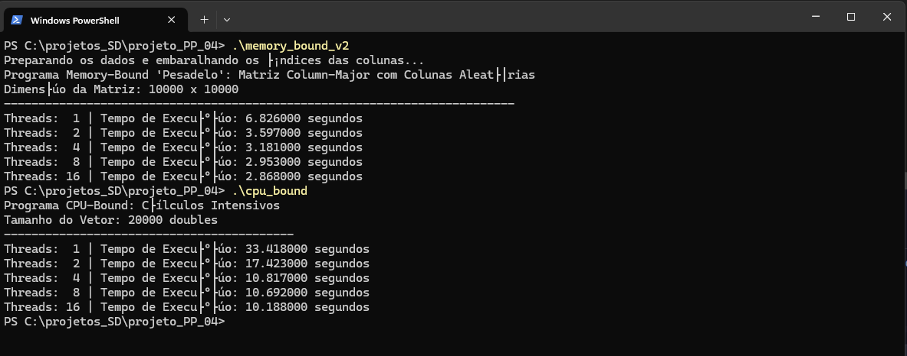

<<<<<<< HEAD
<<<<<<< HEAD
# Projeto PP 04

Breve descrição do que este projeto faz e qual problema ele resolve.

*(Exemplo: Este é o quarto projeto da disciplina de Programação Paralela. O objetivo é analisar o desempenho de algoritmos limitados por CPU (CPU-bound) e por memória (Memory-bound) utilizando OpenMP.)*

## 📝 Sumário

- [Sobre](#-sobre)
- [Tecnologias Utilizadas](#-tecnologias-utilizadas)
- [Pré-requisitos](#-pré-requisitos)
- [Como Compilar e Executar](#-como-compilar-e-executar)
- [Estrutura do Projeto](#-estrutura-do-projeto)
- [Autores](#-autores)

## 📖 Sobre

Forneça uma descrição mais detalhada do projeto aqui. Explique a abordagem utilizada, os algoritmos implementados e os objetivos alcançados.

## 💻 Tecnologias Utilizadas

- **Linguagem:** C
- **Paralelismo:** OpenMP
- **Compilador:** GCC
- **Build System:** Make

## ✅ Pré-requisitos

Antes de começar, você vai precisar ter instalado em sua máquina as seguintes ferramentas:
- Um compilador C com suporte a OpenMP (como o [GCC](https://gcc.gnu.org/))
- [Git](https://git-scm.com)
- [Make](https://www.gnu.org/software/make/)

## 🚀 Como Compilar e Executar

Este projeto utiliza um `Makefile` para simplificar o processo de compilação.

```bash
# 1. Clone este repositório
$ git clone <https://github.com/arleswasb/projeto_PP_04.git>

# 2. Acesse a pasta do projeto
$ cd projeto_PP_04

# 3. Compile todos os programas utilizando o Makefile
# Este comando irá gerar os executáveis: memory_bound, memory_bound_v1, memory_bound_v2 e cpu_bound
$ make -f makefile.mk all

# 4. Execute um dos programas gerados
# Exemplo para o 'memory_bound':
$ ./memory_bound_V2

# Exemplo para o 'cpu_bound':
$ ./cpu_bound

# Para limpar os arquivos compilados, execute:
$ make -f makefile.mk clean
```

## 📁 Estrutura do Projeto

A estrutura de pastas do projeto está organizada da seguinte forma:

```
/
├── main.c        # Arquivo principal do código-fonte
├── .gitignore    # Arquivos e pastas a serem ignorados pelo Git
└── README.md     # Documentação do projeto
```
=======

# Projeto 08: Análise de Desempenho da Estimativa Estocástica de π com OpenMP
=======
# Projeto 09: Análise de Estratégias de Sincronização em OpenMP
### Regiões Críticas Nomeadas vs. Locks Explícitos em Listas Encadeadas
>>>>>>> temp_repo/main


## Descrição do Projeto

<<<<<<< HEAD
Este projeto, desenvolvido para a disciplina de Programação Paralela (DCA3703), realiza uma análise de desempenho de um problema clássico da computação, a estimação da constante matemática π através de métodos estocásticos (Monte Carlo). A tarefa consiste em gerar um grande volume de pontos aleatórios e verificar se eles se encontram dentro de um círculo, uma carga de trabalho inerentemente paralelizável.

O objetivo é analisar o impacto de diferentes estratégias de implementação paralela em OpenMP, combinando duas abordagens para a geração de números aleatórios (`rand()` e `rand_r()`) e duas para a acumulação de resultados (seção crítica e vetor compartilhado).

## Conceitos Abordados

* **Computação Paralela com OpenMP**: Uso de diretivas para paralelizar laços de repetição.
* **Thread-Safety**: Análise do impacto de desempenho ao usar funções não seguras para threads (`rand()`) em comparação com alternativas reentrantes (`rand_r()`).
* **Estratégias de Sincronização**: Comparação entre um mecanismo de bloqueio de software (`#pragma omp critical`) e uma abordagem "lock-free" com vetor compartilhado.
* **Arquitetura de Hardware**: Investigação de como fenômenos de baixo nível, como a **Coerência de Cache** e o **Falso Compartilhamento** (*False Sharing*), afetam o desempenho do código paralelo.

## Estrutura dos Arquivos

O repositório contém as quatro versões do programa, cada uma explorando uma combinação diferente de gargalos de software e hardware:

* `paralelo_rand.c` (Versão 1): Utiliza `rand()` (não thread-safe) para geração de números e `#pragma omp critical` para acumulação.
* `paralelo_rand_vetor.c` (Versão 2): Utiliza `rand()` e um vetor compartilhado para acumulação.
* `paralelo_rand_r.c` (Versão 3): Utiliza `rand_r()` (thread-safe) e `#pragma omp critical`.
* `paralelo_rand_r_vetor.c` (Versão 4): Utiliza `rand_r()` e um vetor compartilhado.
=======
Este projeto, desenvolvido para a disciplina de Programação Paralela (DCA3703), explora e compara diferentes estratégias de sincronização para gerenciar o acesso concorrente a listas encadeadas. O objetivo é analisar o impacto de duas abordagens distintas do OpenMP para resolver o problema clássico de condições de corrida durante múltiplas inserções paralelas em estruturas de dados compartilhadas.

Foram implementadas duas versões para investigar cenários de gerenciamento de recursos:
1.  **Cenário Estático:** Com um número fixo de listas, utilizando regiões críticas nomeadas.
2.  **Cenário Dinâmico:** Com um número `M` de listas definido pelo usuário, exigindo o uso de locks explícitos.

## Conceitos Abordados

* Paralelismo de Dados com a diretiva `#pragma omp parallel for`.
* Sincronização para evitar Condições de Corrida.
* **Regiões Críticas Nomeadas** (`#pragma omp critical (name)`) para múltiplos locks estáticos.
* **Locks Explícitos** (`omp_lock_t`) para sincronização dinâmica e granular.
* Análise comparativa entre Sincronização Estática vs. Dinâmica.
* Locking de Alta Granularidade (*Fine-Grained Locking*).

## Estrutura dos Arquivos

O repositório contém as duas versões do programa, cada uma focada em uma estratégia de sincronização:

* `Duas_listas.c`: Implementação para o cenário estático com **2 listas** e **regiões críticas nomeadas**. Demonstra uma solução de alto nível para um número fixo de recursos.
* `N_listas.c`: Implementação generalizada para **M listas** com **locks explícitos**. Demonstra uma solução flexível e escalável para um número dinâmico de recursos.
>>>>>>> temp_repo/main

## Como Compilar e Executar

O projeto foi desenvolvido em C e utiliza a biblioteca OpenMP. É necessário um compilador com suporte a OpenMP (como o GCC) e a flag `-fopenmp`.

### Compilação

```bash
<<<<<<< HEAD
# Versão 1
gcc -fopenmp -o v1_rand_critical paralelo_rand.c

# Versão 2
gcc -fopenmp -o v2_rand_vetor paralelo_rand_vetor.c

# Versão 3
gcc -fopenmp -o v3_rand_r_critical paralelo_rand_r.c

# Versão 4
gcc -fopenmp -o v4_rand_r_vetor paralelo_rand_r_vetor.c
=======
# Para a versão de 2 listas (estática)
gcc -fopenmp -o duas_listas Duas_listas.c

# Para a versão de M listas (dinâmica)
gcc -fopenmp -o m_listas N_listas.c
>>>>>>> temp_repo/main
````

### Execução

```bash
<<<<<<< HEAD
# Executar cada uma das versões
./v1_rand_critical
./v2_rand_vetor
./v3_rand_r_critical
./v4_rand_r_vetor
```

## Análise e Principais Conclusões

A análise comparativa do tempo de execução das quatro versões revelou insights importantes sobre gargalos em programação paralela. Todas as versões executaram 100.000.000 de iterações.

### Resultados de Desempenho

| Versão | Estratégia | Tempo de Execução (s) |
| :--- | :--- | :--- |
| 1 | `rand()` + Seção Crítica | 15.08 |
| 2 | `rand()` + Vetor | 13.80 |
| 4 | `rand_r()` + Vetor | 0.7613 |
| 3 | `rand_r()` + Seção Crítica | **0.3874** |

### Principais Conclusões

1.  **O Custo de Funções Não Thread-Safe**: O uso da função `rand()`, que não é reentrante, foi o principal gargalo nas Versões 1 e 2. Suas chamadas são serializadas por um lock interno, o que anula quase que completamente os ganhos do paralelismo. A mudança para `rand_r()` resultou em uma melhora drástica de desempenho.

2.  **Falso Compartilhamento (*False Sharing*)**: O resultado mais contraintuitivo foi o desempenho inferior da Versão 4 em comparação com a Versão 3. Embora a Versão 4 seja "livre de locks" em software, ela sofre de um severo gargalo de hardware. O vetor `acertos_por_thread` armazena contadores de threads adjacentes na mesma linha de cache (geralmente 64 bytes). Quando uma thread atualiza seu contador, o protocolo de coerência de cache invalida a linha inteira para as outras threads, forçando-as a recarregar os dados da memória principal, um processo extremamente lento. Esse "ping-pong" da linha de cache entre os núcleos aniquilou os benefícios da abordagem com vetor.

3.  **Gargalos de Hardware vs. Software**: O experimento demonstrou que eliminar um gargalo de software (como uma seção crítica) pode expor um gargalo de hardware ainda mais severo (como o falso compartilhamento). A Versão 3, que utilizou uma função thread-safe e uma sincronização de software simples, foi a mais rápida porque o custo da seção crítica foi menor que o custo da contenção massiva de cache na Versão 4.
>>>>>>> temp_repo/main
=======
# Executar a versão estática
./duas_listas

# Executar a versão dinâmica (o programa solicitará o número de listas)
./m_listas
```

## Abordagens Implementadas

### Versão 1: Cenário Estático com Regiões Críticas Nomeadas

Esta versão aborda o problema para um número fixo de duas listas. A sincronização utiliza a diretiva `#pragma omp critical (name)`, fornecendo nomes distintos para os locks de cada lista (`lock_A` e `lock_B`). Isso permite que inserções em listas diferentes ocorram de forma totalmente concorrente, já que os locks são independentes.

### Versão 2: Cenário Dinâmico com Locks Explícitos

Esta versão generaliza o problema para um número `M` de listas definido pelo usuário em tempo de execução. Como as regiões críticas nomeadas não podem ser criadas dinamicamente, a solução utiliza um array de locks do tipo `omp_lock_t`. Um array de `M` locks é alocado, e o `lock[i]` é usado para proteger a `lista[i]`, permitindo um travamento granular e dinâmico.

## Análise e Conclusões

A análise das duas implementações, detalhada no relatório, leva às seguintes conclusões:

  * A escolha do mecanismo de sincronização é uma **decisão de design** ditada pela natureza do problema (recursos estáticos vs. dinâmicos).
  * **Regiões Críticas Nomeadas** são uma abstração simples e eficaz, mas sua aplicabilidade é restrita a cenários onde os recursos são fixos e conhecidos em tempo de compilação.
  * **Locks Explícitos** são essenciais para cenários dinâmicos, oferecendo flexibilidade e escalabilidade ao custo de uma maior complexidade de gerenciamento (ciclo de vida do lock).
  * Em ambos os casos, a estratégia de **alta granularidade** (um lock por lista) é crucial para minimizar a contenção e maximizar o desempenho, evitando a serialização desnecessária das tarefas.
>>>>>>> temp_repo/main

## Autor

  * **Werbert Arles de Souza Barradas**

-----

<<<<<<< HEAD
<<<<<<< HEAD
**Disciplina:** DCA3-703 - Programação Paralela - T01 (2025.2)  
**Docente:** Professor Doutor Samuel Xavier de Souza  
**Instituição:** Universidade Federal do Rio Grande do Norte (UFRN)


## 💻 imagens




=======
=======
>>>>>>> temp_repo/main
**Disciplina:** DCA3703 - Programação Paralela - T01 (2025.2)  
**Docente:** Professor Doutor Samuel Xavier de Souza  
**Instituição:** Universidade Federal do Rio Grande do Norte (UFRN)

```
```
<<<<<<< HEAD
>>>>>>> temp_repo/main
=======
>>>>>>> temp_repo/main
